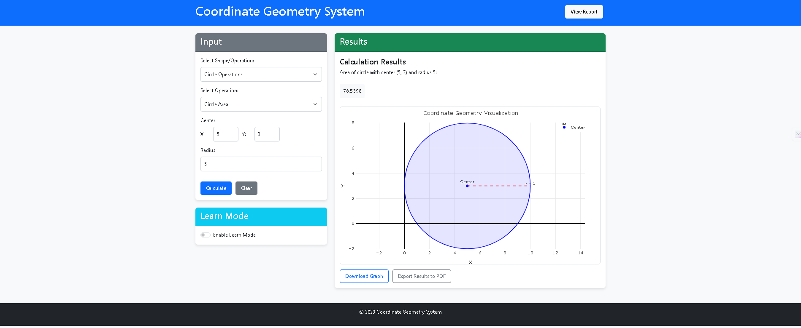

# Coordinate Geometry System

A comprehensive web-based application for performing coordinate geometry operations with interactive visualization. This system combines a Python backend with a responsive frontend to create a powerful tool for geometric calculations and learning.




## Features

- **Comprehensive Geometry Operations**: Perform calculations on points, lines, circles, triangles, and polygons
- **Interactive Visualization**: See results displayed on a dynamic graph
- **Learn Mode**: View explanations of formulas and geometric concepts
- **Export Options**: Download graphs as images or export results as PDF
- **Responsive Design**: Works on desktop and mobile devices
- **Error Handling**: Robust error detection and user-friendly messages

## Technologies Used

- **Backend**:
  - Python 3.8+
  - Flask (Web framework)
  - Object-Oriented Programming principles

- **Frontend**:
  - HTML5, CSS3, JavaScript
  - Bootstrap 5 (Responsive design)
  - Plotly.js (Interactive graphs)
  - MathJax (Mathematical notation)

## Installation

1. Clone the repository:
   ```bash
   git clone https://github.com/Ehtisham1053/Coordinate-Geometry-Application.git
   cd coordinate-geometry-system


## Developed by 
EHTISHAM AFZAL
